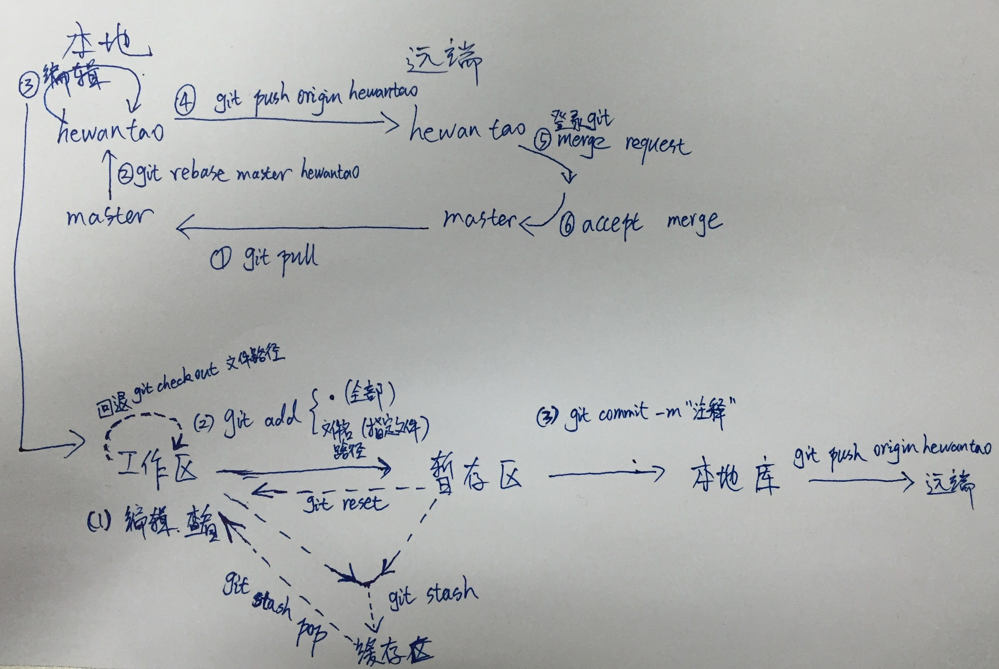
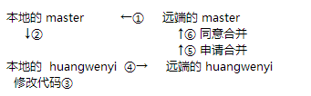
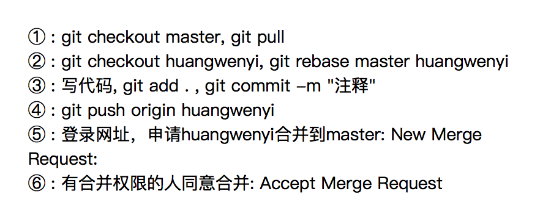

<font color = red size = 15><B>git学习</B></font>

------

绑定（修改）全局用户名和邮箱：  
git config --global user.name "your name"  
git config --global user.email "your_email@youremail.com"

绑定（修改）全局用户名和邮箱：
git config user.name "your name"  
git config user.email "your_email@youremail.com"

ps:去掉后面的“your name”就是查看当前用户名称

取得项目的git仓库：  
`1. 自己创建：`  
```
git init
```
`2. 克隆：`  
```
git clone [url]
```

<font size=5 color=red><B>上传文件到远端仓库</B></font>  

---
`添加到需要提交的文件列表：`
```
添加后缀为.c的文件：git add *.c  
添加所有改动：git add .   
```
`提交到本地：`
```
git commit -m '本次提交的注释，例如：add data'  
```
`上传到远端：`
```
提交到远端：git push
```
---


<font size=5 color=red><B>其他仓库命令：</B></font>  

---
`查看状态:`  
```
git status
```
`撤销本地的提交：`  
```
git push
git reset -­-­hard origin

注意：修改代码后直接git pull不管用（查看git log就知道了），必须先git stash，再git pull，再git stash pop才能把最新的远端 与本地段修改的结合一起
```
---

<font size=5 color=red><B>分支命令：</B></font>  

---

`查看当期分支：`
```
git branch
```
`查看包括远程分支内的所有分支：` 
```
git branch -a
```
`转换分支：`
```
git checkout branchName
```
`提交到分支进行review：`
```
git push origin master:branchName（远端分支名）
```
`删除分支：`
```
git branch -D branchName
```
---

`重命名文件或文件夹：`  
git mv -f oldfolder newfolder  
git add -u newfolder  

`删除文件或文件夹：`
```
删除文件：rm fileName
删除文件夹：rm -r folder
```

## 帅比的笔记：



## 操作流程：



## 具体操作：



------------
码云（类似github）在本地设定多个用户，方便提交：

问题：
1. 码云后台会限制不同的账号不能使用同一个公钥  

```
解决:    本地生成多对公私钥。
```
2. ssh机制，生成密钥对时，若未指定名称，则公私钥路径固定为  ~/.ssh/id_rsa  和  ~/.ssh/id_rsaid_rsa.pub   

```
解决: 本地生成多对公私钥时，单独指定名称。

ssh-keygen -t rsa -C  "xxx@qq.com" 回车后，要输入私钥的名字后再继续回车
Enter file in which to save the key (/Users/hwy/.ssh/id_rsa): id_rsa_test01
```

3. ssh机制，进行登录时，若未指定私钥时，默认使用 ~/.ssh/id_rsa 私钥。

```
解决：

配置ssh_config，指定某个Host用哪个私钥登录（IdentityFile配置项）。
vim /etc/ssh/ssh_config
```
4. 码云的真实Host只有一个，无法使用多个私钥登录。  

```
解决：

配置ssh_config，给码云取多个不同的别名（Host配置项），指向同一个码云的真实域名（HostName配置项）
如： 
Host  gitee-163.com
    HostName        gitee.com
    User      hwy@163.com
    IdentityFile    ~/.ssh/id_rsa_163com

git remote add origin 添加git远端仓库地址时，不要使用码云的真实域名，而使用所取的不同的别名。
如:   
git remote add origin git@gitee-163.com:user1/proj1.git
```
5. 设置git配置时，只针对本项目，不要加global。
```
如：
git config user.name "蜗牛"
git config user.email "hwy_1990@163.com"


Host    别名
    HostName        主机名
    Port            端口
    User            用户名
    IdentityFile    密钥文件的路径


ssh-keygen里-C指定的是备注，即在公钥文件最后面会自动加个空格和此备注
```


出现问题：

1. push的时候出现：“Your branch is up to date with 'origin/master'”
```
    pull分为两步：“git fetch”和“git merge”  
    这种情况运行：“git fetch”更新到最新情况
```
2. push的时候出现：“Everything up-to-date”
```
   重新运行："git add ."
            "git commit -m "message" "
            "git push origin master" 
```


Ans_Flag：39  = 32 + 4 + 2 + 1  
Min_KS：  0.15427408979358456

单位数量：1 2 4 8 16 32 64 128 

最佳的特征选取：min(bws),max(bws),np.mean(bws)，max(BTFD)


