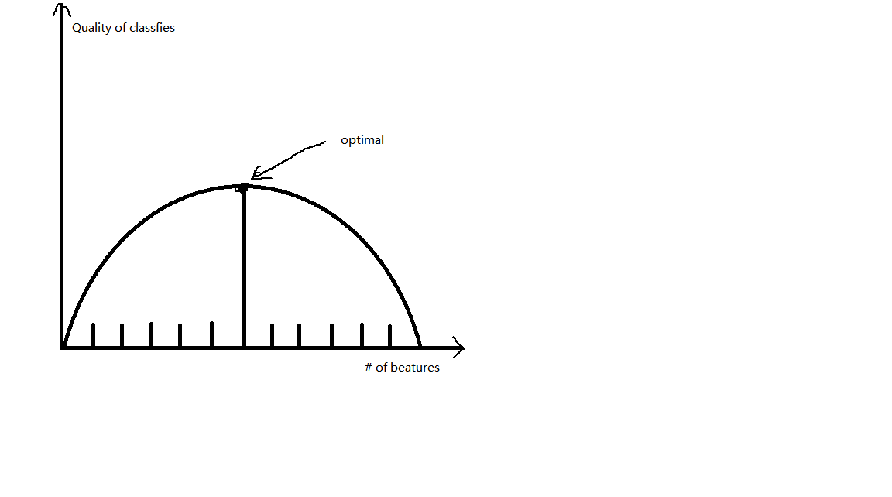
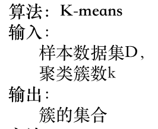
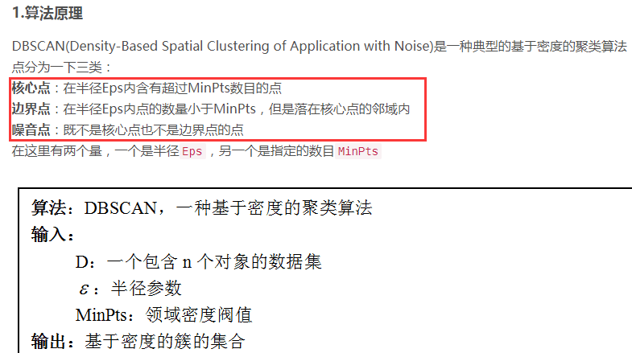
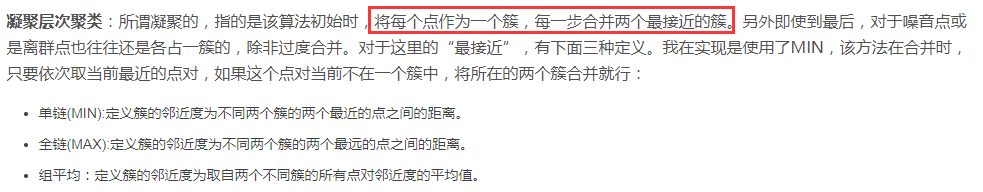

<font color = red size = 8>基于网格的聚类算法</font>

---
---
        聚类是一种无监督聚类算法，无监督指的是事先不知道所需要查找的内容（无目标变量）。聚类将数据点归入多个簇中，相似的数据点归入到同一个簇。有很多不同的方法来计算相似性。广泛使用的是K-均值算法。

`找到了三篇相关论文：`  
* 基于聚类分析的网络流量分类研究_何震凯     2009  
* 基于机器学习算法的P2P流量分类研究_刘永定      2009  
* 基于模型聚类与特征选择策略的网络流分类研究    2014

网址：http://xuewen.cnki.net/CMFD-2010011413.nh.html

---
---
## 三类特征选择方法

本文按照特征选择方法与后续学习算法的关系以及评价准则分成三类：过滤式（Filter）、包裹式（Wrapper）、嵌入式（Embedding）。

1. 过滤式（Filter）特征选择算法:  
Filter特征选择算法通常对特征采用一些特定的标准以此来评估特征的重要程度，对特征排序，设定阈值，就可选出特征子集。由于它与学习算法无关，这就使得它较为高效。在过去几十年里，有多种过滤式特征选择方法的评价标准被提出，大致可分为四类：距离度量、信息度量、相关性度量、一致性度量。

2. 包裹式（Wrapper）特征选择算法  
Wrapper模型将学习算法作为特征选择算法的一部分，并且直接使用分类性能作为特征重要性程度的评价标准，最终将选择的子集用于构造分类模型。该方法所选特征子集较为准确，但所用时间较长。
此类特征选择方法常使用快速的搜索算法，选出特征子集并输入分类器中。如 Hsu 等人使用遗传算法搜索特征子集，并用决策树的分类准确率作为评价指标，选取准确率最高的特征子集。Dai等人将SVM分类器与PSO算法结合，提出了一种快速特征选择的方法。为了更快的特征选择同时保证特征选择的准确，往往将 Filter 方法和 Wrapper 方法相结合，先使用 Filter 方法在原始特征集中选出特征子集，然后输入到 Wrapper方法中，从而选出满足分类器的最的特征子集。如Alamedine 等提出的将 ReliefF 算法和 PSO 算法结合，得到了一种快速的Wrapper算法。

3. 嵌入式（Embedded）特征选择算法
Embedded类特征算法结合了Filter和Wrapper类的优点，利用分类器内部的参数对特征进行排序，这样就有效地结合了分类器的性能同时提高了运算效率。大体将嵌入式算法（Embedded）分为三类
--------------
参考网址：https://zhuanlan.zhihu.com/p/24635014  
主题：特征选取，经典三刀

对于特征个数：



---
---


        俗话说：“物以类聚，人以群分”，在机器学习中，聚类算法是一种无监督分类算法。聚类算法很多，包括基于划分的聚类算法（如：kmeans），基于层次的聚类算法（如：BIRCH），基于密度的聚类算法（如：DBScan），基于网格的聚类算法等等。基于划分和层次聚类方法都无法发现非凸面形状的簇，真正能有效发现任意形状簇的算法是基于密度的算法，但基于密度的算法一般时间复杂度较高，1996年到2000年间，研究数据挖掘的学者们提出了大量基于网格的聚类算法，网格方法可以有效减少算法的计算复杂度，且同样对密度参数敏感。


## 聚类算法分类

1. 基于划分  
给定一个有N个元组或者纪录的数据集，分裂法将构造K个分组，每一个分组就代表一个聚类，K<N。   
特点：计算量大。很适合发现中小规模的数据库中小规模的数据库中的球状簇。   
算法：K-MEANS算法、K-MEDOIDS算法、CLARANS算法  

2. 基于层次  
对给定的数据集进行层次似的分解，直到某种条件满足为止。具体又可分为“自底向上”和“自顶向下”两种方案。   
特点：较小的计算开销。然而这种技术不能更正错误的决定。   
算法：BIRCH算法、CURE算法、CHAMELEON算法  

3. 基于密度  
只要一个区域中的点的密度大过某个阈值，就把它加到与之相近的聚类中去。   
特点：能克服基于距离的算法只能发现“类圆形”的聚类的缺点。   
算法：DBSCAN算法、OPTICS算法、DENCLUE算法  

4. 基于网格  
将数据空间划分成为有限个单元（cell）的网格结构,所有的处理都是以单个的单元为对象的。   
特点：处理速度很快，通常这是与目标数据库中记录的个数无关的，只与把数据空间分为多少个单元有关。   
算法：STING算法、CLIQUE算法、WAVE-CLUSTER算法
--------------------- 
作者：陶瑞同学  
来源：CSDN  
原文：https://blog.csdn.net/qq_30262201/article/details/78799926  
版权声明：本文为博主原创文章，转载请附上博文链接！


---
---

## `wavecluster:`

步骤1） 对特征空间进行量化，把每个维度分成m段，这样，整个空间分成单元，然后把对象分机到相应的单元；

步骤2） 对量化后的特征空间进行离散小波变换；

步骤3） 在变化后的特征空间的子波段中找出相连的部分，就是簇；

步骤4） 为每个簇所包含的单元分配相应的标签；

步骤5） 建立查找表，用于把变换后特征空间中的单元映射到原特征空间中的单元；

步骤6） 把每个单元的标签分配给该单元内的所有对象。

---
---


基于划分（K-Means），基于层次，基于密度（DBSCAN），基于网络。四个我看了一下。  
## 个人觉得： 

1. K-Means最`简单粗暴`，输入数据，按规定分类就OK了，分类的`效果一般`。  


2. 其次是密度分类，主要是根据一定半径中点的个数来分类。


3. 比较好的是层次分类，根据一个一个的点，不断扩张，最后成组。  


4. 网格分类，这个目前没有找到代码，不过可用于凸面形状的簇，算法比密度分类好。  
```
基于划分和层次聚类方法都无法发现非凸面形状的簇，真正能有效发现任意形状簇的算法是基于密度的算法，但基于密度的算法一般时间复杂度较高，1996年到2000年间，研究数据挖掘的学者们提出了大量基于网格的聚类算法，网格方法可以有效减少算法的计算复杂度，且同样对密度参数敏感。
```


---
---

## PS: 聚类数据生成器
```
def standar_scaler(points):  
    p = StandardScaler().fit_transform(points)  
    return p

centers = [[1, 1], [-1, -1], [-1, 1], [1, -1]]  
point, labelsTrue = make_blobs(n_features=2,n_samples=10000,  centers=centers, cluster_std=0.4,random_state=0)  
point = standar_scaler(point)

# n_features : 设置每个样本有几个特征值，默认值是2
# n_samples : 取多少个样本数，默认值100
# centers : 样本中心点有几个，默认值是3
# random_state : 设置随机数种子，防止每次生成的数据都修改。默认是np.random。
# cluster_std : 每个类别的方差。默认值是1.0   # shuffle : 洗乱，默认值是True
# center_box : 中心确认之后的数据边界，默认值（-10.0， 10.0）
```
---------------------
作者：培旭瞬间   
来源：CSDN   
原文：https://blog.csdn.net/qq_39051220/article/details/78717231   


--- 
---  

## 分类结果的评测  
1. 聚类没有统一的评价指标  
因为不同聚类算法的目标函数相差很大，有些是基于距离的，比如kmeans，有些是假设先验分布的，比如GMM，LDA，有些是带有图聚类和谱分析性质的，比如谱聚类，还有些是基于密度的。  
不过最简单的还是目测法，数据比较少的情况下，通过trace图进行判断
拿谱聚类距离，其中有一种叫 normalized 谱聚类，基于 normlaized Laplacian matrix，它的目标函数里面已经包含了对类簇间数目的约束( normalized cut )，所以聚类出来的结果天然地能使得 类间数目较平均。但你不能拿这个作为评估它结果的指标，否则就因果颠倒了  

2. 应该嵌入到问题中进行评价  
很多实际问题中，聚类仅仅是其中的一步，可以对比不聚类的情形（比如人为分割、随机分割数据集等等），所以这时候我们评价『聚类结果好坏』，其实是在评价『聚类是否能对最终结果有好的影响』


3. 聚类趋势（聚类前）  
霍普金斯统计量（Hopkins Statistic）评估给定数据集是否存在有意义的可聚类的非随机结构。如果一个数据集是有随机的均匀的点生成的，虽然也可以产生聚类结果，但该结果没有意义。聚类的前提需要数据是非均匀分布的。该值在区间[0, 1]之间，[0.01, 0.3]表示数据结构regularly spaced，该值为0.5时数据是均匀分布的，[0.7, 0.99]表示聚类趋势很强。

4. 目前提出的聚类方法
有很多已经被提出的聚类算法好坏评价算法，诸如CH,I,DB,SD,S_Dbw等等，然而这些算法可能会受数据的“异常”而产生对结果的影响，诸如数据中的噪声等。我们提出了五类可能会预测精度的数据异常情况：单调性、噪声、密度、subcluster、倾斜分散。每种情况都会用这11种评价算法测试一下，最终发现，S_Dbw算法完爆其他算法。

原本（聚类效果好坏的评测指标）链接：https://www.smwenku.com/a/5b8c5d132b717718833250bc/zh-cn/

S_Dbw算法的链接：https://github.com/iphysresearch/S_Dbw_validity_index


```
from sklearn.neighbors import NearestNeighbors
from random import sample
from numpy.random import uniform
import numpy as np
from math import isnan
 
def hopkins(X):
    d = X.shape[1]
    #d = len(vars) # columns
    n = len(X) # rows
    m = int(0.1 * n) # heuristic from article [1]
    nbrs = NearestNeighbors(n_neighbors=1).fit(X.values)
 
    rand_X = sample(range(0, n, 1), m)
 
    ujd = []
    wjd = []
    for j in range(0, m):
        u_dist, _ = nbrs.kneighbors(uniform(np.amin(X,axis=0),np.amax(X,axis=0),d).reshape(1, -1), 2, return_distance=True)
        ujd.append(u_dist[0][1])
        w_dist, _ = nbrs.kneighbors(X.iloc[rand_X[j]].values.reshape(1, -1), 2, return_distance=True)
        wjd.append(w_dist[0][1])
 
    H = sum(ujd) / (sum(ujd) + sum(wjd))
    if isnan(H):
        print ujd, wjd
        H = 0
 
    return H
```


2. 聚类质量  
因为没有标签，所以一般通过评估类的分离情况来决定聚类质量。类内越紧密，类间距离越小则质量越高。我用到过的有sklearn中的Silhouette Coefficient和Calinski-Harabaz Index，sklearn里面解释的很清楚，直接把数据和聚类结果作为输入就可以了。


DBScan的分类，目测分类结果不太好。  
聚类的质量评测  


1、在未被标记的数据点中随机选择一个点作为中心center；  
2、找出离center距离在bandwidth之内的所有点，记做集合M，认为这些点属于簇c。同时，把这些求内点属于这个类的概率加1，这个参数将用于最后步骤的分类。  
3、以center为中心点，计算从center开始到集合M中每个元素的向量，将这些向量相加，得到向量shift。  
4、center = center+shift。即center沿着shift的方向移动，移动距离是||shift||。  
5、重复步骤2、3、4，直到shift的大小很小（就是迭代到收敛），记住此时的center。注意，这个迭代过程中遇到的点都应该归类到簇c。  
6、如果收敛时当前簇c的center与其它已经存在的簇c2中心的距离小于阈值，那么把c2和c合并。否则，把c作为新的聚类，增加1类。  
7、重复1、2、3、4、5直到所有的点都被标记访问。  
8、分类：根据每个类，对每个点的访问频率，取访问频率最大的那个类，作为当前点集的所属类。  
简单的说，mean shift就是沿着密度上升的方向寻找同属一个簇的数据点。


